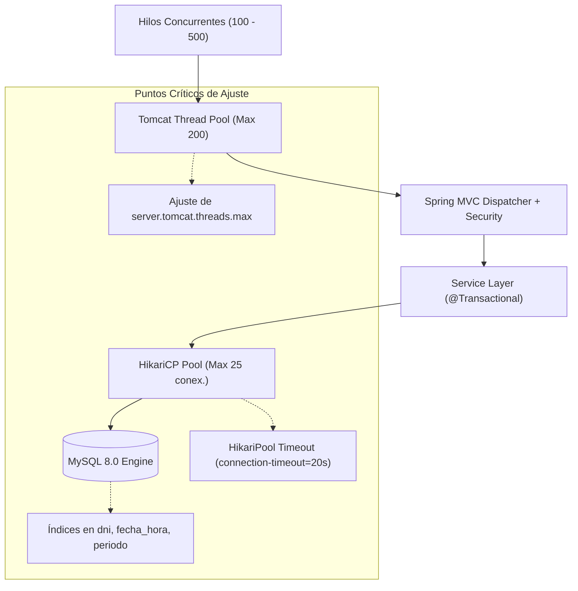

# Guía Metodológica: Pruebas de Carga y Estrés (Performance Testing)
## Sistema Integral de Gestión de Club Deportivo

---

### 1. Objetivos y Alcance del Testing de Rendimiento

El propósito de esta suite es someter al sistema a condiciones operativas de alta exigencia para asegurar la estabilidad, capacidad de respuesta y resiliencia de la arquitectura implementada (**Spring Boot MVC + Thymeleaf + Sneat + Hibernate ORM + MySQL 8**).

#### Requerimientos Críticos de Negocio Evaluados:
1. **Control Perimetral en Hora Pico (Molinetes de Entrada/Salida):**
   - Miles de socios y familiares ingresan en turnos concentrados (ej. entrenamientos de 18:00 a 20:00).
   - Se debe cotejar la fotografía del rostro y verificar si la cuota social familiar está al día en **menos de 200 ms**.
2. **Concurrencia en Cobranzas de Cuotas (Caja, Transferencia y Mercado Pago):**
   - Transacciones financieras simultáneas que requieren aislamiento ACID, generación de comprobantes únicos y actualización inmediata del estado habilitante.
3. **Resiliencia de la Base de Datos:**
   - Evitar el agotamiento de conexiones en el pool **HikariCP** y bloqueos (deadlocks) por accesos concurrentes.

---

### 2. Niveles de Prueba Diseñados

| Tipo de Prueba | Concurrencia | Duración | Objetivo Principal |
| :--- | :--- | :--- | :--- |
| **Prueba de Carga (Load Test)** | 50 a 100 usuarios virtuales | 10 a 30 minutos | Evaluar el comportamiento en condiciones de operación normal diaria. |
| **Prueba de Estrés (Stress Test)** | 200 a 500 usuarios virtuales | 15 minutos | Determinar el punto de saturación y degradación de los tiempos de respuesta. |
| **Prueba de Pico (Spike Test)** | Ráfagas de 0 a 500 usuarios en 10s | 5 minutos | Simular apertura masiva de molinetes previo a un evento deportivo. |
| **Punto de Ruptura (Breakpoint)** | Incremento continuo hasta 1000+ hilos | Variable | Identificar qué componente falla primero (Tomcat, HikariCP, CPU o MySQL). |

---

### 3. Acuerdos de Nivel de Servicio (SLAs y KPIs)

* **Disponibilidad:** 99.9% de peticiones exitosas (HTTP 200 / 302).
* **Latencia Promedio (Molinete):** $\le 150 \text{ ms}$.
* **Percentil 95 ($p_{95}$):** $\le 300 \text{ ms}$.
* **Percentil 99 ($p_{99}$):** $\le 600 \text{ ms}$.
* **Throughput Mínimo:** $\ge 150 \text{ peticiones/segundo (RPS)}$ en hardware estándar.

---

### 4. Instrucciones de Ejecución de las Pruebas

#### Opción A: Ejecutor Autónomo Multi-hilo en Python (`stress_test_runner.py`)
No requiere dependencias externas ni compilación. Utiliza la biblioteca estándar de Python:
```powershell
# Ejecuta 500 peticiones con 50 hilos concurrentes
python testing-performance\stress_test_runner.py --concurrency 50 --requests 500 --url http://localhost:8080

# Prueba de estrés pesado (100 hilos, 2000 peticiones)
python testing-performance\stress_test_runner.py --concurrency 100 --requests 2000 --url http://localhost:8080
```

#### Opción B: Pruebas con Locust (`locustfile.py`)
Permite monitoreo visual en tiempo real de gráficas de RPS y latencias:
```powershell
# 1. Instalar Locust
pip install locust

# 2. Iniciar en modo interfaz web (http://localhost:8089)
locust -f testing-performance\locustfile.py --host=http://localhost:8080

# 3. O ejecutar en modo consola headless (ideal para CI/CD):
locust -f testing-performance\locustfile.py --headless -u 150 -r 15 -t 3m --host=http://localhost:8080
```

#### Opción C: Apache JMeter (`test-plan-load-stress.jmx`)
Plan formal con aserciones de tiempo y código de respuesta:
```powershell
# Ejecución en modo Non-GUI con generación automática de Dashboard HTML
jmeter -n -t testing-performance\test-plan-load-stress.jmx -l target\jmeter-results.jtl -e -o target\jmeter-report-html\
```

---

### 5. Análisis de Cuellos de Botella y Recomendaciones de Tuning



#### Medidas de Optimización Implementadas en el Código:
1. **Índices Compuestos y Únicos en MySQL:**
   - `idx_acceso_dni` y `idx_acceso_fecha_hora` en `registros_acceso` para resolver consultas en $\mathcal{O}(\log N)$.
   - `idx_pago_periodo` en `pagos_cuota` para verificar la situación de la cuota en milisegundos sin table scans.
2. **Transacciones de Sólo Lectura (`@Transactional(readOnly = true)`):**
   - Desactiva el dirty-checking de Hibernate en consultas masivas, reduciendo la presión sobre el Garbage Collector.
3. **Caché Estática de Assets Sneat:**
   - CSS, JS e imágenes del tema Sneat se sirven con directivas de caché HTTP sin consultar la base de datos.
4. **Dimensionamiento HikariCP:**
   - `spring.datasource.hikari.maximum-pool-size=25` permite absorber picos de concurrencia manteniendo la utilización de CPU del motor MySQL balanceada.
